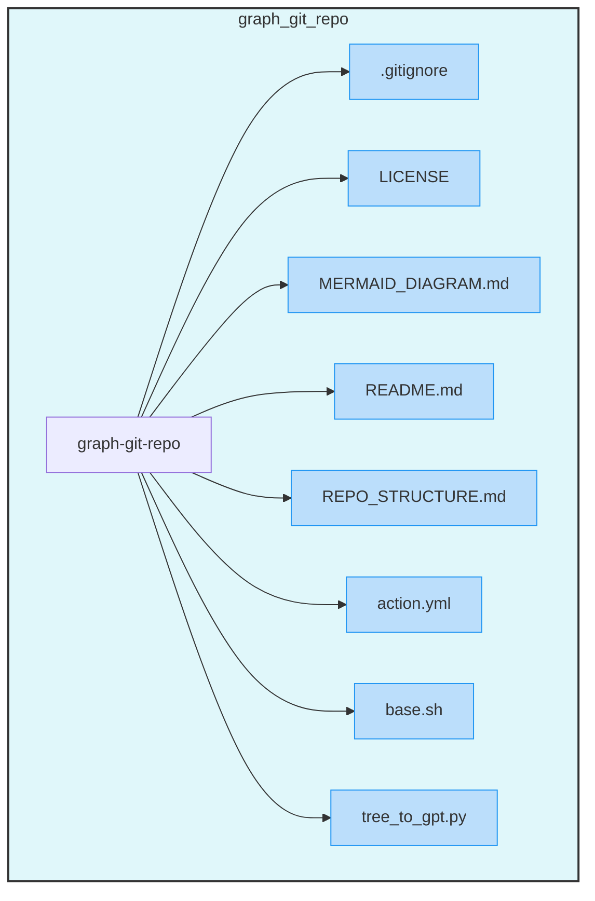

# Mermaid Diagram

```mermaid
graph TD
    %% Repository Structure
    subgraph graph_git_repo
        root[graph-git-repo]
        root --> gitignore[.gitignore]
        root --> LICENSE[LICENSE]
        root --> MERMAID[MERMAID_DIAGRAM.md]
        root --> README[README.md]
        root --> REPO_STRUCTURE[REPO_STRUCTURE.md]
        root --> action[action.yml]
        root --> script[base.sh]
        root --> tree_script[tree_to_gpt.py]
    end
    style graph_git_repo fill:#e0f7fa,stroke:#333,stroke-width:2px;
    style gitignore fill:#bbdefb,stroke:#2196f3,stroke-width:1px;
    style LICENSE fill:#bbdefb,stroke:#2196f3,stroke-width:1px;
    style MERMAID fill:#bbdefb,stroke:#2196f3,stroke-width:1px;
    style README fill:#bbdefb,stroke:#2196f3,stroke-width:1px;
    style REPO_STRUCTURE fill:#bbdefb,stroke:#2196f3,stroke-width:1px;
    style action fill:#bbdefb,stroke:#2196f3,stroke-width:1px;
    style script fill:#bbdefb,stroke:#2196f3,stroke-width:1px;
    style tree_script fill:#bbdefb,stroke:#2196f3,stroke-width:1px;
```