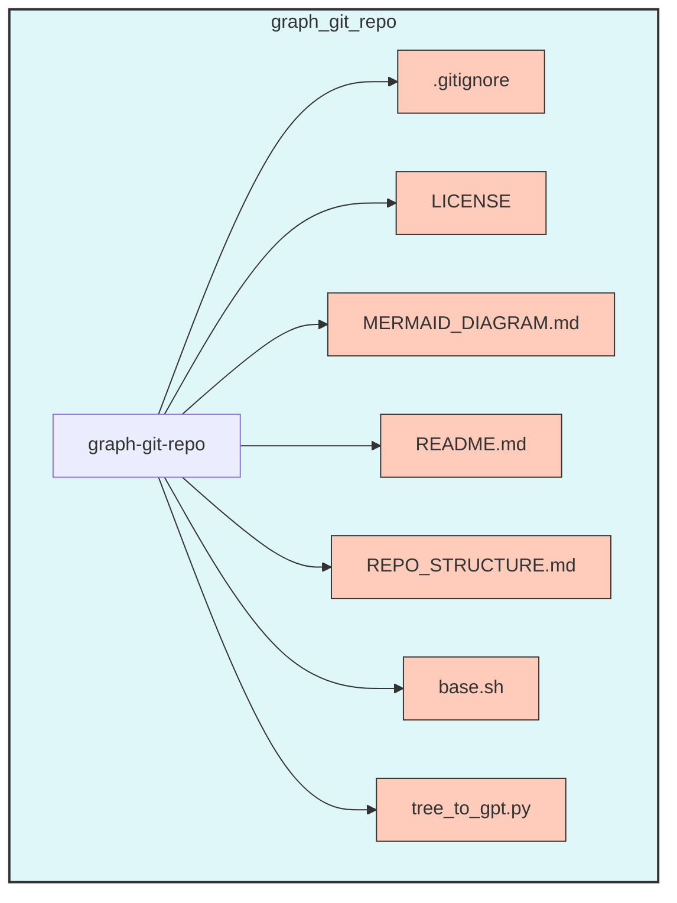

# Mermaid Diagram

```mermaid
graph TD
    %% Repository Structure
    subgraph graph_git_repo
        root[graph-git-repo]
        root --> gitignore[.gitignore]
        root --> license[LICENSE]
        root --> mermaid[MERMAID_DIAGRAM.md]
        root --> README[README.md]
        root --> repo_structure[REPO_STRUCTURE.md]
        root --> base[base.sh]
        root --> tree_to_gpt[tree_to_gpt.py]
    end
    style graph_git_repo fill:#e0f7fa,stroke:#333,stroke-width:2px;
    style gitignore fill:#ffccbc,stroke:#333,stroke-width:1px;
    style license fill:#ffccbc,stroke:#333,stroke-width:1px;
    style mermaid fill:#ffccbc,stroke:#333,stroke-width:1px;
    style README fill:#ffccbc,stroke:#333,stroke-width:1px;
    style repo_structure fill:#ffccbc,stroke:#333,stroke-width:1px;
    style base fill:#ffccbc,stroke:#333,stroke-width:1px;
    style tree_to_gpt fill:#ffccbc,stroke:#333,stroke-width:1px;
```