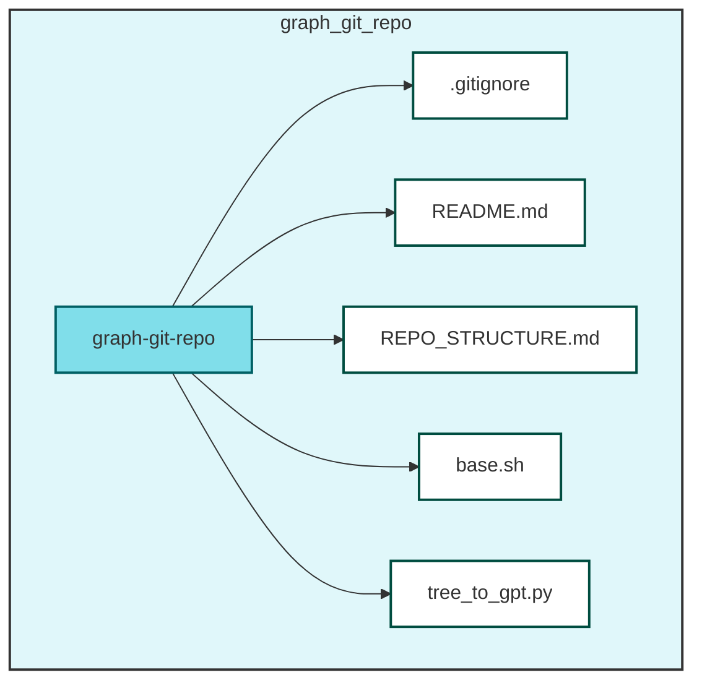

# Mermaid Diagram

```mermaid
graph TB
    %% Repository Structure
    subgraph graph_git_repo
        root[graph-git-repo]:::folder
        root --> gitignore[.gitignore]:::file
        root --> README[README.md]:::file
        root --> REPO_STRUCTURE[REPO_STRUCTURE.md]:::file
        root --> base[base.sh]:::file
        root --> tree_to_gpt[tree_to_gpt.py]:::file
    end
    style graph_git_repo fill:#e0f7fa,stroke:#333,stroke-width:2px;
    classDef folder fill:#80deea,stroke:#006064,stroke-width:2px;
    classDef file fill:#ffffff,stroke:#004d40,stroke-width:2px;
```