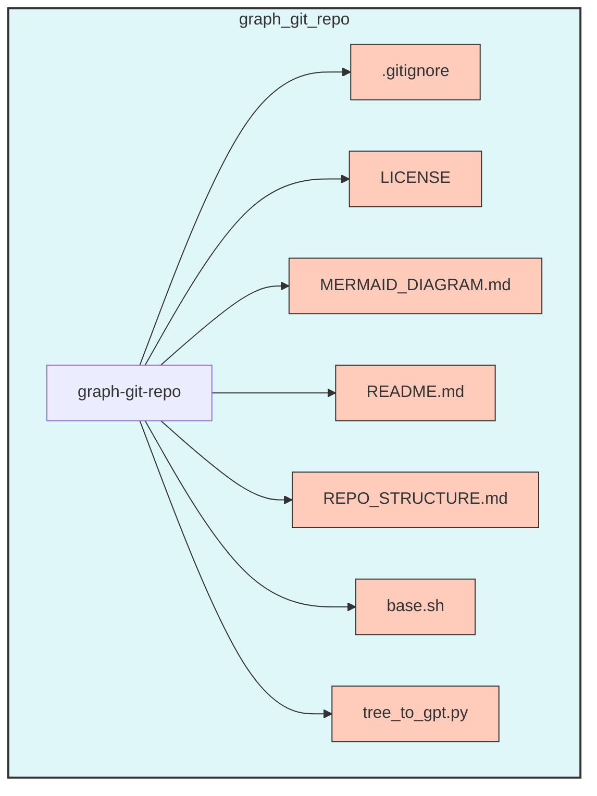

# Generate [mermaid](https://github.com/mermaid-js/mermaid) Repo Structure Action

[](https://github.com/PGSch/graph-git-repo/releases)
[](https://github.com/PGSch/graph-git-repo/blob/main/LICENSE)
[](https://github.com/sponsors/PGSch)
[](https://twitter.com/intent/follow?screen_name=pgschdev)

## Overview

**graph-git-repo** is a GitHub Action that automatically generates a visual representation of your repository's structure using the `tree` command and outputs it as a [Mermaid](https://github.com/mermaid-js/mermaid) diagram. It allows users to exclude specific files or directories using customizable patterns, and generates a Markdown file (`REPO_STRUCTURE.md`) along with a `MERMAID_DIAGRAM.md` for easy visualization.

## Features

- **Customizable Exclusions**: Specify patterns to exclude files or directories from the generated structure.
- **Markdown & Mermaid Output**: Generates both `REPO_STRUCTURE.md` and `MERMAID_DIAGRAM.md` files.
- **Artifact Management**: Uploads generated files as artifacts for easy download.
- **Optional PR Creation**: Automatically creates a pull request with the generated files if desired.

## How It Works

1. **Define the Workflow**: Include this action in your GitHub workflow.
2. **Customize Exclusions**: Specify which files or directories to exclude through the `exclude_patterns` input.
3. **Generate Structure & Diagram**: The action runs scripts to create `REPO_STRUCTURE.md` and `MERMAID_DIAGRAM.md`.
4. **Manage Output**: Outputs are uploaded as artifacts, and a PR can be created to include them in your repository.

## Usage

To use this action in your repository, include it in your GitHub workflow YAML file. Below is an example configuration:

### Example Workflow

```yaml
name: Test Graph Git Repo

on:
  workflow_dispatch:
    inputs:
      exclude_patterns:
        description: 'Patterns to exclude (e.g., ".git|*.log|node_modules")'
        required: false
        default: '.git|.DS_Store|.idea|*.log|*.tmp|__pycache__'
      depth:
        description: 'Tree depth to consider'
        required: false
        default: '2'
      create_pr:
        description: 'Whether to create a pull request with the generated files'
        required: false
        default: 'false'

jobs:
  test-graph-git-repo:
    runs-on: ubuntu-latest

    steps:
      - name: Checkout target repository code
        uses: actions/checkout@v4

      - name: Use Graph Git Repo Action
        uses: PGSch/graph-git-repo@v1
        with:
          exclude_patterns: ${{ inputs.exclude_patterns }}
          depth: ${{ inputs.depth }}
          create_pr: ${{ inputs.create_pr }}
          openai_api_key: ${{ secrets.OPENAI_API_KEY }}
          github_token: ${{ secrets.GITHUB_TOKEN }}
```

### Inputs

| Input Name         | Required | Description                                                                                                  |
|--------------------|----------|--------------------------------------------------------------------------------------------------------------|
| `exclude_patterns` | `false`  | Patterns to exclude from the tree structure (e.g., ".git                                                     |*.log|node_modules"). Default is provided.       |
| `depth`            | `false`  | Specifies the depth of the tree structure to generate.                                                       |
| `create_pr`        | `false`  | Determines whether to create a pull request with the generated files (`true` or `false`). Default is `true`. |

### Outputs

The action generates two files:
- **`REPO_STRUCTURE.md`**: A Markdown-based representation of the repository's structure.
- **`MERMAID_DIAGRAM.md`**: A Mermaid diagram of the repository structure.

### Required Permissions

This action requires the following permissions to function properly:
- **Contents**: `write` (to commit the generated structure back to the repository if `create_pr` is `true`).

## Advanced Configuration

### Customizing Exclusions

You can specify patterns to exclude directly in your workflow file:

```yaml
with:
  exclude_patterns: '.git|node_modules|*.log|*.env'
```

### Triggering the Action

The action can be triggered manually using the GitHub UI or automatically as part of your CI/CD pipeline.

### REPO_STRUCTURE.md
```markdown
graph-git-repo
├── .gitignore
├── LICENSE
├── MERMAID_DIAGRAM.md
├── README.md
├── REPO_STRUCTURE.md
├── base.sh
└── tree_to_gpt.py
```

### MERMAID_DIAGRAM.md



## Contributing

We welcome contributions to improve **graph-git-repo**!

Please open an issue or submit a pull request for any features or bug fixes you’d like to see.

## License

This project is licensed under the MIT License - see the [LICENSE](LICENSE) file for details.
